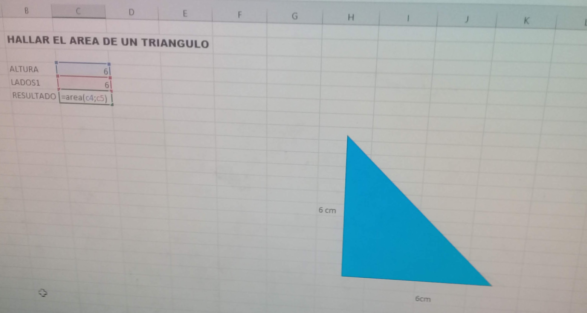

# Octubre 25 del 2021

En esta clase el instructor nos estubo repasando un poco mas de funciones y nos dejo una actividad en la cual deberiamos realizar una funcion nosotros mismos.

## actividad Function

Mi idea fue realizar una funcion que hallara el area de un triangulo y estos fueron los resultados.

# ejercicio en excel

```
Function area(b, h)

  lados = (b * h) / 2
  altura = lado1 + b
  area = lados

End Function
```

