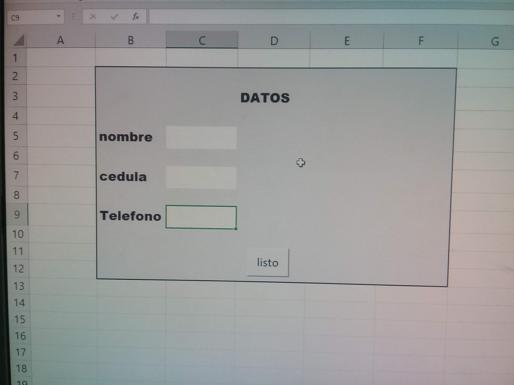

# Septiembre 20 del 2021

En la clase pasada el instructor nos enseño a hacer un formulario y nos dejo
un ejercicio.

# Actividad de desarrollo

## Ejercicio en excel

```
Sub prueba()

  datos.Cells(2, 2) = form.Cells(5, 3)
  datos.Cells(3, 2) = form.Cells(7, 3)
  datos.Cells(4, 2) = form.Cells(9, 3)
    MsgBox "registrado con exito"
  form.Cells(5, 3) = Empty
  form.Cells(7, 3) = Empty
  form.Cells(9, 3) = Empty

End Sub
```

## formulario



## Funcion mis notas

```
Function misnotas(a, e, i, o, u)

     x = (a + e + i + o + u) / 5

    If (x > 7) Then
     misnotas = "el estudiante aprobo con" & x
    Else
     misnotas = "el estudiante reprobo con" & x
    End If
End Function
```
