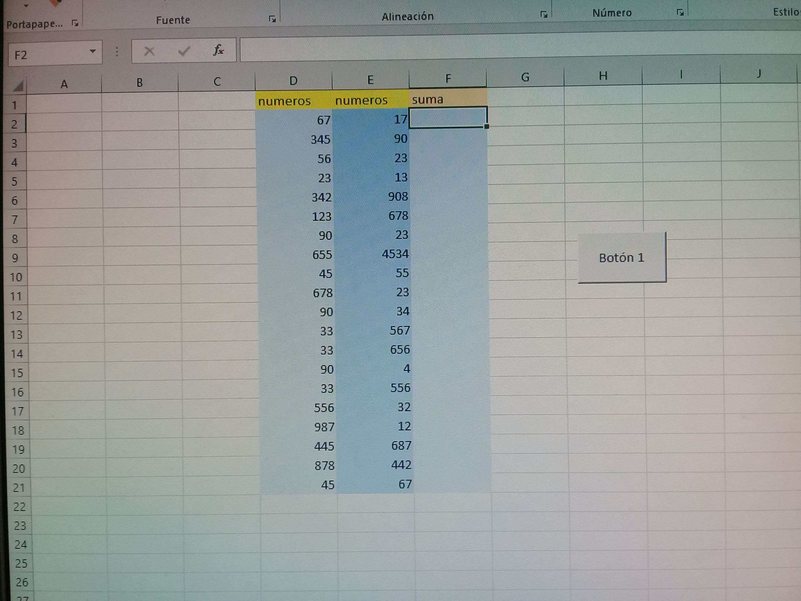

# Septiembre 30 del 2021

En esta clase el instructor nos hablo de los ciclos.

## ¿Que es un ciclo?

Un ciclo es una estructura que se repite las veces que quiera el usuario.

## Ciclo (for i)
## Ejercicio en excel


# Ejercicio de desarrollo

## Ejercicio en excel

```
Sub ejercicio()

   For i = 2 To 21

    suma.Cells(i, 6) = suma.Cells(i, 4) + suma.Cells(i, 5)


   Next i

End Sub
```

