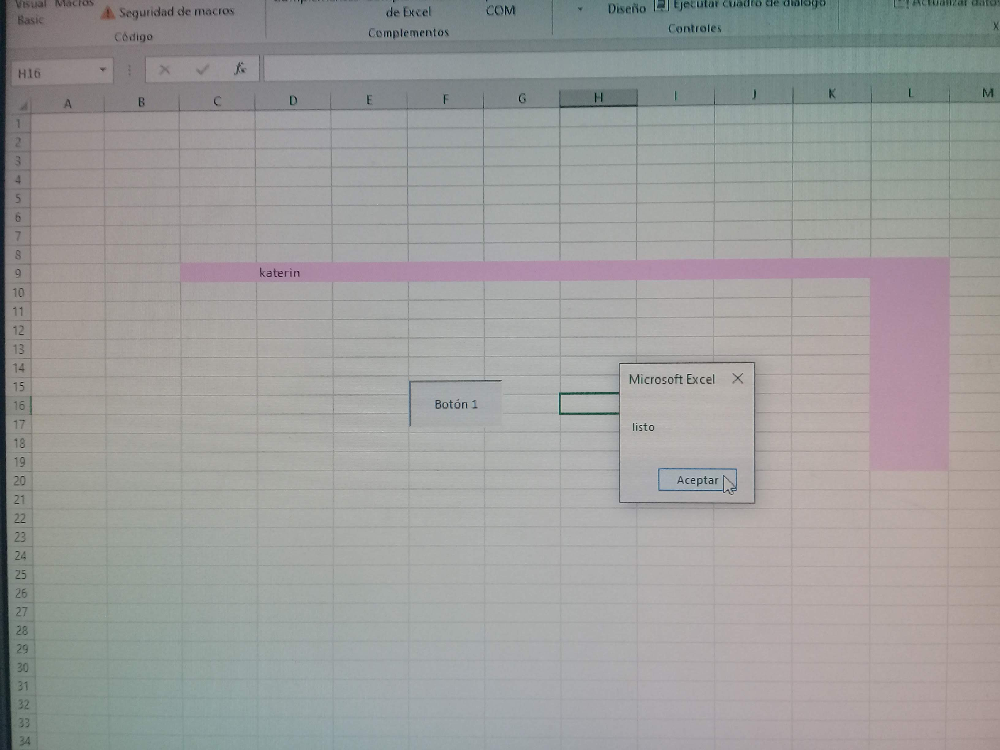

# Septiembre 30 del 2021

En esta clase el instructor nos hablo de los ciclos.

## ¿Que es un ciclo?

Un ciclo es una estructura que se repite las veces que quiera el usuario.

## Ciclo (for i)
## Ejercicio en excel


# Ejercicio de desarrollo

## Ejercicio en excel 1

En este ejercicico pusimos en practica como crear un codigo que sume algunos numeros.

```
Sub ejercicio()

   For i = 2 To 21

    suma.Cells(i, 6) = suma.Cells(i, 4) + suma.Cells(i, 5)


   Next i

End Sub
```


## Ejercicio en excel 2

En este ejercicio aprendimos a desplazar una palabra en "L" por la hoja de excel.

```
Sub ejercicio()

   n1 = "katerin"

    For i = 3 To 12
       mov.Cells(9, i - 1) = ""
       mov.Cells(9, i) = n1
       MsgBox "listo"

    Next i

      For i = 10 To 19

        mov.Cells(i - 1, 12) = ""
        mov.Cells(i, 12) = n1
        MsgBox "listo"

      Next i
        mov.Cells(i - 1, 12) = ""

End Sub
```


## Funcion mis notas

```
Function misnotas(a, e, i, o, u)

     x = (a + e + i + o + u) / 5

    If (x > 7) Then
     MsgBox "el estudiante" & y & " aprobo"
    Else
    MsgBox "el estudiante" & y & " reprobo"


End Function
```
