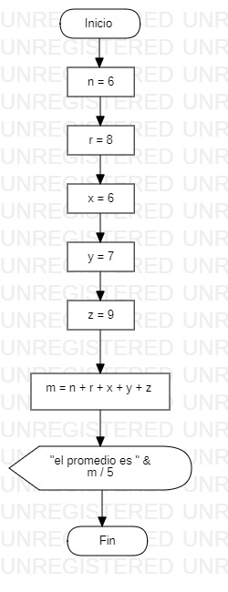

# Septiembre 5 del 2021

 En esta clase el instructor nos enseño a como hacer operaciones basicas
  matematicas con visual basic y con, tambien, conocimos un nuevo simbolo
  en diagrama de flujo llamado manual input que se utiliza para leer lo que nos
  da el usuario.

## Ejeccicio en excel

```
Sub ejemplo()

  a = 23
  b = 10
  c = a + b
  MsgBox "el resultado de la suma es " & c

End Sub
```

## Ejercicio en dartpad

```
void main() {

   int a = 100;
   int b = 15;
   int c = a + b;
   print("el resultado de la suma es  $c");

}
```

# Actividad de desarrollo

1.Hacer un programa en excel que calcule el promedio de 5 numeros y los
muestre por pantalla.
2.Hacer diagrama de flujo.

## Ejercicio en excel

```
Sub promedio()
  n = InputBox("anota el primer numero")
  r = InputBox("anota el segundo numero")
  x = InputBox("anota el tercer numero")
  y = InputBox("anota el cuarto numero")
  Z = InputBox("anota el quinto numero")
  m = Int(n) + Int(r) + Int(x) + Int(y) + Int(Z)
  MsgBox "el promedio es " & m / 5
End Sub
```
## Diagrama de flujo


